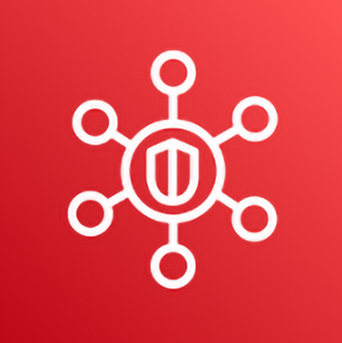

# AWS Security Hub

{ width=50 }

## Upload findings to Security Hub

In the following example using the template `asff.tpl`, [ASFF][asff] file can be generated.

```
$ AWS_REGION=us-west-1 AWS_ACCOUNT_ID=123456789012 gitscan image --format template --template "@contrib/asff.tpl" -o report.asff golang:1.12-alpine
```

ASFF template needs AWS_REGION and AWS_ACCOUNT_ID from environment variables.

The Product [ARN][arn] field follows the pattern below to match what AWS requires for the [product resource type][resource-type].


```
"ProductArn": "arn:aws:securityhub:{{ env "AWS_REGION" }}::product/aquasecurity/aquasecurity",
```


In order to upload results you must first run [enable-import-findings-for-product][enable] like:

```
aws securityhub enable-import-findings-for-product --product-arn arn:aws:securityhub:<AWS_REGION>::product/aquasecurity/aquasecurity
```

The findings are [formatted for the API][asff-syntax] with a key of `Findings` and a value of the array of findings.
In order to upload via the CLI the outer wrapping must be removed being left with only the array of findings.
The easiest way of doing this is with the [jq library][jq] using the command 

```
cat report.asff | jq '.Findings'
```

Then, you can upload it with AWS CLI.

```
$ aws securityhub batch-import-findings --findings file://report.asff
```

### Note

The [batch-import-findings][batch-import-findings] command limits the number of findings uploaded to 100 per request.
The best known workaround to this problem is using [jq][jq] to run the following command

```
jq '.[:100]' report.asff 1> short_report.asff
```

## Customize
You can customize [asff.tpl][asff.tpl]

```
$ export AWS_REGION=us-west-1
$ export AWS_ACCOUNT_ID=123456789012
$ gitscan image --format template --template "@your-asff.tpl" -o report.asff golang:1.12-alpine
```

## Reference
[aws.amazon.com/blogs/security/how-to-build-ci-cd-pipeline-container-vulnerability-scanning-gitscan-and-aws-security-hub/](https://aws.amazon.com/blogs/security/how-to-build-ci-cd-pipeline-container-vulnerability-scanning-gitscan-and-aws-security-hub/)

[asff]: https://docs.aws.amazon.com/securityhub/latest/userguide/securityhub-findings-format.html
[asff-syntax]: https://docs.aws.amazon.com/securityhub/latest/userguide/securityhub-findings-format-syntax.html
[arn]: https://docs.aws.amazon.com/general/latest/gr/aws-arns-and-namespaces.html
[resource-type]: https://github.com/awsdocs/aws-security-hub-user-guide/blob/master/doc_source/securityhub-partner-providers.md#aqua-security--aqua-cloud-native-security-platform-sends-findings
[enable]: https://docs.aws.amazon.com/cli/latest/reference/securityhub/enable-import-findings-for-product.html
[batch-import-findings]: https://docs.aws.amazon.com/cli/latest/reference/securityhub/batch-import-findings.html#options
[asff.tpl]: https://github.com/aquasecurity/gitscan/blob/main/contrib/asff.tpl

[jq]: https://stedolan.github.io/jq/